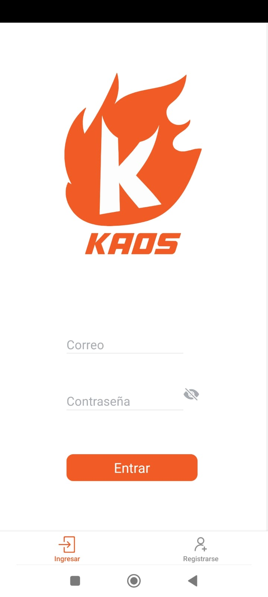
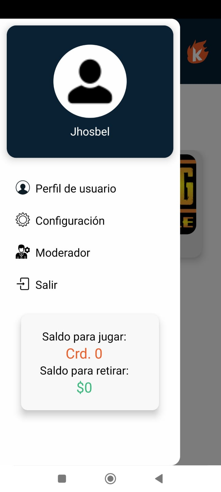
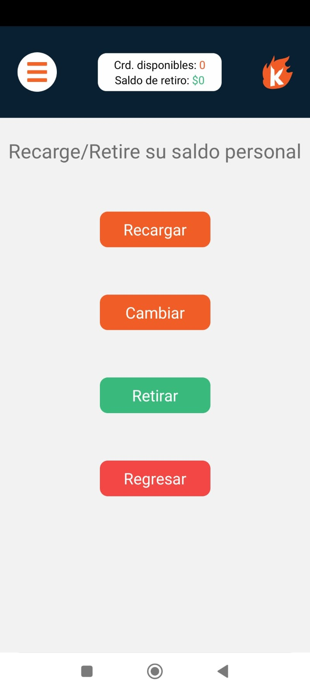
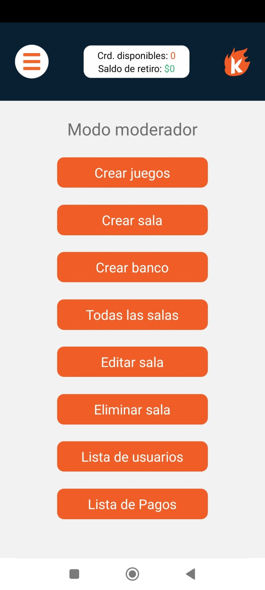

# KAOS - Plataforma de Salas de Juego Competitivo

<p align="center">
    
</p>

KAOS is a mobile application developed in React Native using Expo, designed to create and manage gaming rooms for mobile and PC games. The app allows users to participate in competitive matches, top up their balance (in credits), and convert those credits into real money. Additionally, administrators can manage rooms, confirm top-ups, finalize matches, and distribute statistics.

The main goal of KAOS is to provide a platform where players can compete, earn credits, and withdraw their winnings while administrators efficiently manage the ecosystem.

## 🚀 Descripción

KAOS is a platform where users can:

- Create and join game rooms with cash rewards
- Manage credits convertible into real money
- Compete in various mobile and PC games
- Manage profiles and financial transaction

Administrators can:

- Manage rooms, users, and transactions
- Verify matches and statistics
- Control the credit and payment system

## ✨ Características Principales

### Usuarios

- JWT Authentication
- Customizable profile (avatar, name, details)
- Credit system (deposit/withdrawal)
- Linked game registration
- Participation in competitive rooms
- Transaction and match history
- Support for multiple payment methods

### Administradores/Moderadores

- Management Dashboard
- Recharge verification
- Room creation/deletion
- Detailed match statistics
- User management (bans, warnings)
- Game and category administration
- Banking transaction control

## 🛠 Tecnologías Utilizadas

- **Frontend:**
    - React Native
    - Expo
    - Context API (Global state management)
    - Apollo Client (GraphQL)
    - Expo ImagePicker (Image management)
    - React Navigation

- **Backend:**
    - GraphQL
    - JWT (Authentication)
    - REST API (For authentication)

## 📌 Previous Requirements

- Node.js (v18+)
- Expo CLI
- Android Studio (for emulator)
- Expo Account (optional)

## 🔧 Installation

1.  Clone the repository:

    ```bash
    git clone https://github.com/jhosbel/kaos-expo-app
    cd kaos-expo-app
    ```

2.  Install dependencies:

    ```bash
    npm install
    # o
    yarn install
    ```

3.  Configure environment variables:
    Create a `.env` file in the root directory with:

        EXPO_PUBLIC_BACKEND_URL=tu_url_backend

4.  Start the development server:

    ```bash
    yarn start
    ```

5.  Run on emulator/physical Android device:

    ```bash
    # For Android
    npx expo run:android
    ```

## ⚙ Configuration

Environment Variables:

- `EXPO_PUBLIC_BACKEND_URL`: URL of the GraphQL backend

Physical Device:

1. Install Expo Go

2. Scan the QR code from the development console

## 📄 Project Structure

    /Kaos-app
    ├── app
    │   ├── (tabs)
    │   ├── screens
    │   ├── _layout.tsx
    │   ├── apolloClient.ts
    │   ├── index.tsx
    ├── assets
    │   ├── fonts
    │   ├── images
    ├── components
    │   ├── Icons
    ├── constants
    ├── context
    ├── graphql
    ├── screenshots
    ├── .env
    └── README.md

## 📱 Screenshots

<!-- Agrega capturas de tu app aquí -->
<p align="center">
    
    
    
    
    
</p>

## 🤝 Contribution

1. Fork the project

2. Create your branch `git checkout -b feature/nueva-funcionalidad`

3. Commit changes `git commit -m 'Agrega nueva funcionalidad`

4. Push to the branch `git push origin feature/nueva-funcionalidad`

5. Open a Pull Request

## 📄 License

MIT © Jhosbel
